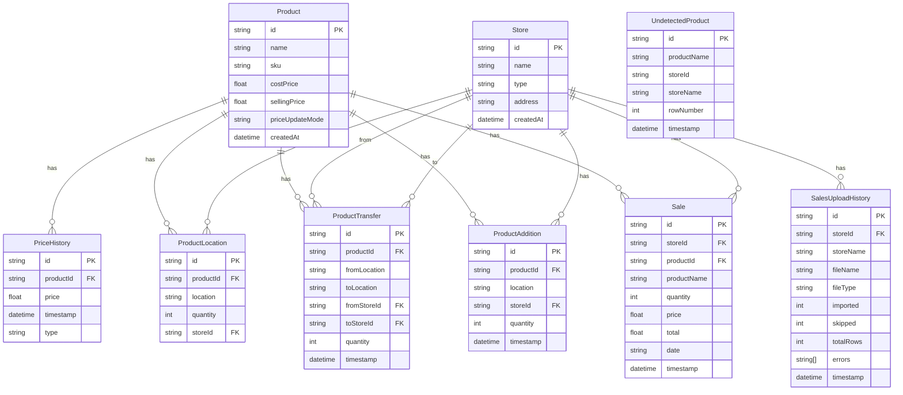

# Entity Relationship Diagram (ERD)
## Sistem Manajemen Produk & Penjualan - Annel Beauty Analytics

## Penjelasan Relasi

### 1. Product (Produk)
- **Relasi One-to-Many dengan:**
  - `PriceHistory` - Satu produk bisa memiliki banyak history harga
  - `ProductLocation` - Satu produk bisa berada di banyak lokasi
  - `ProductTransfer` - Satu produk bisa memiliki banyak transfer
  - `ProductAddition` - Satu produk bisa memiliki banyak penambahan stok
  - `Sale` - Satu produk bisa memiliki banyak penjualan

### 2. Store (Toko)
- **Relasi One-to-Many dengan:**
  - `ProductLocation` - Satu toko bisa memiliki banyak lokasi produk
  - `ProductTransfer` (fromStoreId) - Satu toko bisa menjadi sumber transfer
  - `ProductTransfer` (toStoreId) - Satu toko bisa menjadi tujuan transfer
  - `ProductAddition` - Satu toko bisa memiliki banyak penambahan stok
  - `Sale` - Satu toko bisa memiliki banyak penjualan
  - `SalesUploadHistory` - Satu toko bisa memiliki banyak history upload

### 3. ProductLocation (Lokasi Produk)
- **Relasi Many-to-One dengan:**
  - `Product` - Banyak lokasi produk dimiliki oleh satu produk
  - `Store` - Banyak lokasi produk dimiliki oleh satu toko (opsional, untuk gudang tidak ada storeId)

### 4. ProductTransfer (Transfer Produk)
- **Relasi Many-to-One dengan:**
  - `Product` - Banyak transfer dimiliki oleh satu produk
  - `Store` (fromStoreId) - Banyak transfer berasal dari satu toko
  - `Store` (toStoreId) - Banyak transfer menuju ke satu toko

### 5. ProductAddition (Penambahan Stok)
- **Relasi Many-to-One dengan:**
  - `Product` - Banyak penambahan dimiliki oleh satu produk
  - `Store` - Banyak penambahan dimiliki oleh satu toko (opsional, untuk gudang tidak ada storeId)

### 6. Sale (Penjualan)
- **Relasi Many-to-One dengan:**
  - `Product` - Banyak penjualan dimiliki oleh satu produk
  - `Store` - Banyak penjualan dimiliki oleh satu toko

### 7. PriceHistory (History Harga)
- **Relasi Many-to-One dengan:**
  - `Product` - Banyak history harga dimiliki oleh satu produk

### 8. SalesUploadHistory (History Upload CSV)
- **Relasi Many-to-One dengan:**
  - `Store` - Banyak history upload dimiliki oleh satu toko

### 9. UndetectedProduct (Produk Tidak Terdeteksi)
- **Tidak memiliki relasi Foreign Key** - Tabel independen untuk menyimpan produk yang tidak terdeteksi saat upload CSV

## Atribut Kunci

### Primary Keys (PK)
- Semua tabel menggunakan `id` sebagai Primary Key dengan tipe `String` (UUID)

### Foreign Keys (FK)
- `PriceHistory.productId` → `Product.id`
- `ProductLocation.productId` → `Product.id`
- `ProductLocation.storeId` → `Store.id` (nullable)
- `ProductTransfer.productId` → `Product.id`
- `ProductTransfer.fromStoreId` → `Store.id` (nullable)
- `ProductTransfer.toStoreId` → `Store.id` (nullable)
- `ProductAddition.productId` → `Product.id`
- `ProductAddition.storeId` → `Store.id` (nullable)
- `Sale.productId` → `Product.id`
- `Sale.storeId` → `Store.id`
- `SalesUploadHistory.storeId` → `Store.id`

## Constraint & Index

### Unique Constraints
- `ProductLocation`: Unique pada kombinasi `(productId, location, storeId)`

### Indexes
- `PriceHistory`: Index pada `(productId, timestamp)` dan `(productId, type)`
- `ProductLocation`: Index pada `productId`
- `ProductTransfer`: Index pada `(productId, timestamp)`
- `ProductAddition`: Index pada `(productId, timestamp)`
- `Sale`: Index pada `(storeId, date)`, `(productId, date)`, dan `timestamp`
- `SalesUploadHistory`: Index pada `(storeId, timestamp)`

## Cascade Delete

- Semua relasi dengan `Product` menggunakan `onDelete: Cascade` - Jika produk dihapus, semua data terkait juga terhapus
- Relasi dengan `Store` menggunakan `onDelete: Cascade` atau `onDelete: SetNull` tergantung konteks

